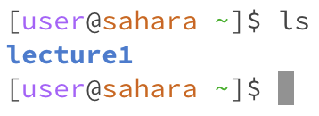
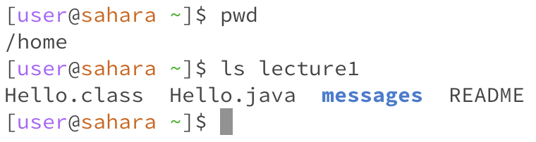

# Lab Report 1
## Remote Access and Filesystem (Week 1)

**Command: `cd`**

*Using the command with no arguments:*

Working directory before the command was run: `/home`

Reason for result: No path was provided to the command, so it did not go anywhere.

Was result error?: No. If no argument is provided, then this command is meant to do nothing.

*Using the command with a path to a directory as argument:*

Working directory before the command was run: `/home`

Reason for result: The relative path `./lecture1` was given, and the command changed the working directory to that directory.

Was result error?: No. The OS did not throw an error.

*Using the command with a path to a file as argument:*

Working directory before the command was run: `/home/lecture1`

Reason for result: The relative path `Hello.java` was given, but the command could not be executed because the path led to a file and not a directory.

Was result error?: Yes. `cd` should only be used for directories.

**Command: `ls`**

*Using the command with no arguments:*

Working directory before the command was run: `/home`

Reason for result: The OS listed the contents of the working directory (`/home`).

Was result error?: No. The command ran successfully.

*Using the command with a path to a directory as argument:*

Working directory before the command was run: `/home`

Reason for result: The OS interpreted the argument as a file path (a relative one), and listed the contents of the resulting directory (`/home/lecture1`).

Was result error?: No. The command ran successfully.

*Using the command with a path to a file as argument:*

Working directory before the command was run: `/home/lecture1`

Reason for result: The OS recognized that the argument was a file path leading to a file, and printed the name of that file.

Was result error?: No. Printing the name of a file is intended behavior for the ls command.

**Command: `cat`**

*Using the command with no arguments:*

Working directory before the command was run: `/home/lecture1`

Reason for result: Without an argument, the OS used the terminal as the input, thus causing it to echo anything typed by the user until the command was halted.

Was result error?: No. Using the terminal as input, in the absence of an argument, is intended behavior for the cat command.

*Using the command with a path to a directory as argument:*

Working directory before the command was run: `/home/lecture1`

Reason for result: The relative path messages was given, but the command could not be executed because the path led to a directory and not a file.

Was result error?: Yes. cat should only be used for files.

*Using the command with a path to a file as argument:*

Working directory before the command was run: `/home/lecture1`

Reason for result: The OS interpreted the argument as a file path (a relative one), and printed the contents of the file that the path led to.

Was result error?: No. The command ran successfully.
