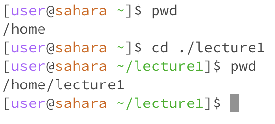

# Lab Report 1
## Remote Access and Filesystem (Week 1)

**Command: cd**

*Using the command with no arguments:*

Working directory before the command was run: /home

Reason for result: No path was provided to the command, so it did not go anywhere.

Was result error?: No. If no argument is provided, then this command is meant to do nothing.

*Using the command with a path to a directory as argument:*

Working directory before the command was run: /home

Reason for result: The relative path ./lecture1 was given, and the command changed the working directory to that directory.

Was result error?: No. The OS did not throw an error.

*Using the command with a path to a file as argument:*

Working directory before the command was run:

Reason for result:

Was result error?:

**Command: ls**

*Using the command with no arguments:*

Working directory before the command was run:

Reason for result:

Was result error?:

*Using the command with a path to a directory as argument:*

Working directory before the command was run:

Reason for result:

Was result error?:

*Using the command with a path to a file as argument:*

Working directory before the command was run:

Reason for result:

Was result error?:

**Command: cat**

*Using the command with no arguments:*

Working directory before the command was run:

Reason for result:

Was result error?:

*Using the command with a path to a directory as argument:*

Working directory before the command was run:

Reason for result:

Was result error?:

*Using the command with a path to a file as argument:*

Working directory before the command was run:

Reason for result:

Was output result?:
