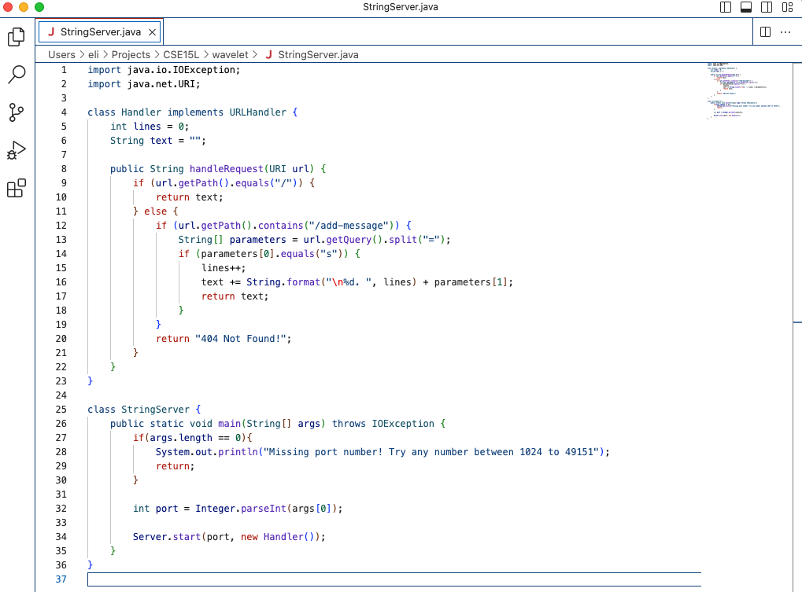
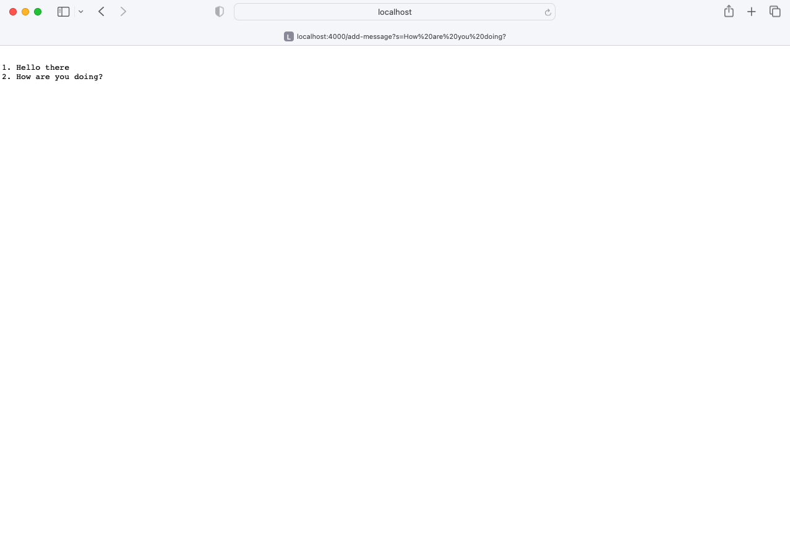
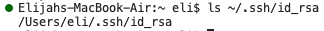
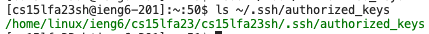
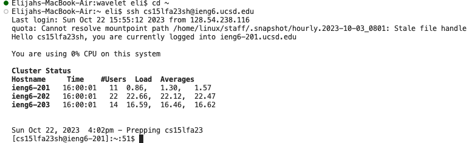

# Lab Report 2
## Servers and SSH Keys (Week 3)

**Part 1:**

*My `StringServer` code:*

*The first example of using `/add-message`:*

Which methods are called: `handleRequest` is called.

The relevant arguments and fields: `handleRequest`'s argument `url` (value `/add-message?s=Hello%20there`), `Handler`'s field `lines` (value `0`), `Handler`'s field `text` (value `""`)

Changes to relevant fields: `lines` becomes `1` and `text` becomes `"\n1. Hello there"`.

*The second example of using `add-message`:*

Which methods are called: `handleRequest` is called.

The relevant arguments and fields: `handleRequest`'s argument `url` (value `/add-message?s=How%20are%20you%20doing?`), `Handler`'s field `lines` (value `1`), `Handler`'s field `text` (value `"\n1. Hello there"`)

Changes to relevant fields: `lines` becomes `2` and `text` becomes `"\n1. Hello there\n2. How are you doing?"`.

**Part 2:**

*The file path to my private key on my computer:*

*The file path to my public key on ieng6:*

*An example of me logging onto ieng6 without being asked for a password:*

**Part 3:**

One thing I learned from lab recently that I didn't know before is that it's easier than I thought to create a webpage with Java. I took a look at the Server.java file, and although it's certainly not *trivial*, it's simpler than I expected.
