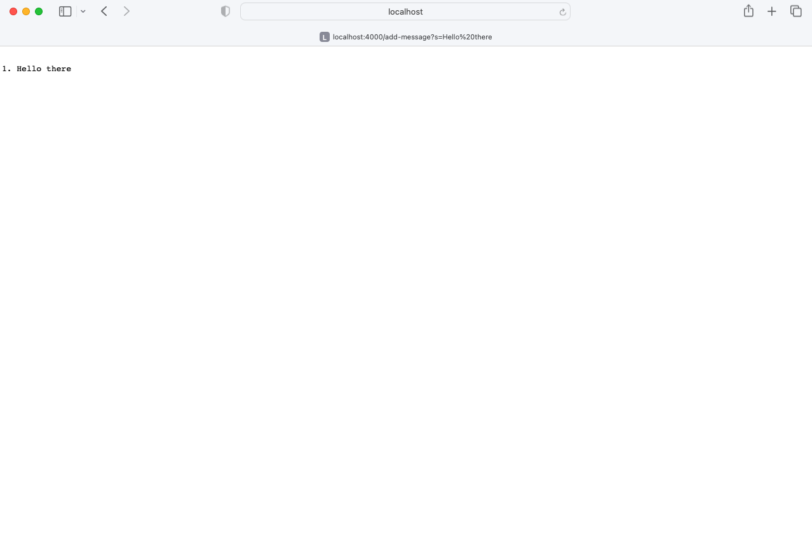

# Lab Report 2
## Servers and SSH Keys (Week 3)

**Part 1:**

Which methods are called: `handleRequest` is called.

The relevant arguments and fields: `handleRequest`'s argument `url` (value `/add-message?s=Hello%20there`), `Handler`'s field `lines` (value `0`), `Handler`'s field `text` (value `""`)

Changes to relevant fields: `lines` becomes `1` and `text` becomes `"\n1. Hello there"`.

todo: image3

Which methods are called: `handleRequest` is called.

The relevant arguments and fields: ???

Changes to relevant fields: ???
