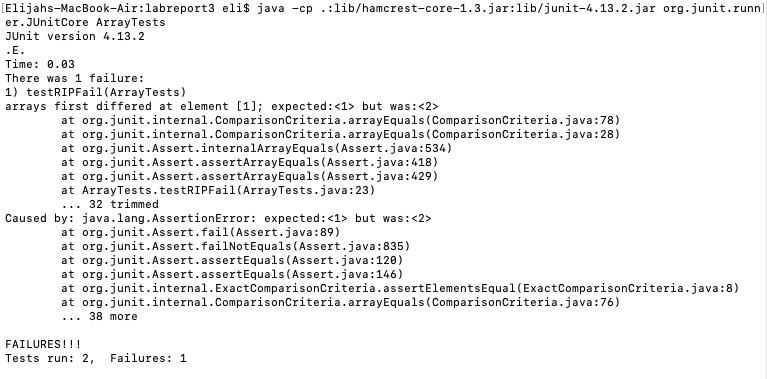

# Lab Report 3
## Bugs and Commands (Week 5)

**Part 1:**

The bug in question is the one in `reverseInPlace` in `ArrayExamples`.

*Failure-inducing input:*

```
@Test 
public void testRIPFail() {
  int[] input1 = { 1, 2 };
  ArrayExamples.reverseInPlace(input1);
  assertArrayEquals(new int[]{ 2, 1 }, input1);
}
```

*Non-failure-inducing input:*

```
@Test 
public void testRIPSucceed() {
  int[] input1 = { 5 };
  ArrayExamples.reverseInPlace(input1);
  assertArrayEquals(new int[]{ 5 }, input1);
}
```

*Symptom:*



*The bug:*

```
static void reverseInPlace(int[] arr) {
  for(int i = 0; i < arr.length; i += 1) {
    arr[i] = arr[arr.length - i - 1];
  }
}
```

*The bug, fixed:*

```
static void reverseInPlace(int[] arr) {
  for(int i = 0; i < arr.length/2; i += 1) {
    int temp = arr[i];
    arr[i] = arr[arr.length - i - 1];
    arr[arr.length - i - 1] = temp;
  }
}
```

*Explanation of the fix:*

The bug is that the program overwrote the first half of the array with the second half of the array, effectively discarding the first half of the array. The bug was fixed by changing the program to swap pairs of elements.

**Part 2:**

*Command:* `grep`

(Working directory: `technical`)

(`-r` was covered in the lab)

*Option:* `-C`

Source: `man grep`

```
grep -r -C1 "cardiac arrest" .

./biomed/1472-6823-3-1.txt-        57.3% of patients with diabetic ketoacidosis. The leading
./biomed/1472-6823-3-1.txt:        specified causes of death were cardiac arrest of unknown
./biomed/1472-6823-3-1.txt-        cause (8.5%), acute myocardial infraction (5%), sepsis
--
./biomed/1472-6823-3-1.txt-        hyperosmolar syndrome was acute myocardial infarction
./biomed/1472-6823-3-1.txt:        (18%), cardiac arrest of unknown cause (13%), and sepsis
./biomed/1472-6823-3-1.txt-        (9%).
--
./biomed/cc1477.txt-        the original definitions [ 2]. Postoperative patients with
./biomed/cc1477.txt:        sepsis or cardiac arrest were included with non-operative
./biomed/cc1477.txt-        patients with these conditions [ 2]. ICU and hospital
--
./biomed/cc1477.txt-        database of APACHE II, some interesting differences appear.
./biomed/cc1477.txt:        The post cardiac arrest category, which is associated with
./biomed/cc1477.txt-        a high mortality risk (APACHE II diagnostic category weight
--
./biomed/1471-2369-4-5.txt-        HIVAN, the leading causes of death were AIDS (50%),
./biomed/1471-2369-4-5.txt:        missing/unknown (10.7%), and cardiac arrest of unknown
./biomed/1471-2369-4-5.txt-        cause (10.7%). Factors independently associated with
--
./biomed/1471-2369-4-1.txt-        cause of death among patients hospitalized for atrial
./biomed/1471-2369-4-1.txt:        fibrillation was unknown (26%), followed by cardiac arrest
./biomed/1471-2369-4-1.txt-        of unknown cause (19%), cardiac arrthymia (8%), acute
--
./biomed/1471-2431-2-12.txt-        decreased oral intake. Though one of these episodes was
./biomed/1471-2431-2-12.txt:        associated with cardiac arrest at two years of age, she
./biomed/1471-2431-2-12.txt-        always responded well to treatment without apparent
```

`-C` tells the command to print the preceding and subsequent lines relative to the lines in which the search term was found, and the `1` tells the command to print 1 line from either end. This is useful because a single line isn't always enough to get a good idea of whether the term was used with the meaning you're looking for or not.

```
grep -r -C1 "chlorophyll" .

./biomed/1472-6890-2-5.txt-          mouse monoclonal antibodies directed against CD45 (clone
./biomed/1472-6890-2-5.txt:          2D1, peridin-chlorophyll-a-protein [PerCP]-conjugated,)
./biomed/1472-6890-2-5.txt-          as well as various combinations of CD26 (fluorescien
--
./biomed/1471-2229-1-2.txt-        in the chloroplast genome. The primary cofactor for the
./biomed/1471-2229-1-2.txt:        photochemical reactions in these complexes, chlorophyll
./biomed/1471-2229-1-2.txt-        (Chl) 
--
./biomed/1471-2229-1-2.txt-        these complexes. The end-product of the Chl biosynthetic
./biomed/1471-2229-1-2.txt:        pathway in plants in the dark, protochlorophyllide
./biomed/1471-2229-1-2.txt-        (Pchlide), is unable to support the assembly processes,
--
./biomed/1471-2229-1-2.txt-        Abbreviations
./biomed/1471-2229-1-2.txt:        Chl, chlorophyll; Chlide, chlorophyllide; Pchlide,
./biomed/1471-2229-1-2.txt:        protochlorophyllide; LHC, light-harvesting complex; LHCII,
./biomed/1471-2229-1-2.txt-        LHC associated primarily with photosystem II; LHCP, LHC
--
./biomed/gb-2002-3-11-research0061.txt-          photoactivation there is an electron-transfer chain from
./biomed/gb-2002-3-11-research0061.txt:          the primary donor - the bacteriochlorophyll molecules -
./biomed/gb-2002-3-11-research0061.txt-          to the primary quinone, and then to the secondary
--
./biomed/gb-2003-4-1-r5.txt-          Arabidopsis thaliana genes
./biomed/gb-2003-4-1-r5.txt:          corresponding to chlorophyll a/b-binding protein (Cab),
./biomed/gb-2003-4-1-r5.txt-          lipid transfer protein 4 (Ltp4), lipid transfer protein 6
--
./biomed/1471-2164-3-4.txt-          agreement with the recent analyses of genes involved in
./biomed/1471-2164-3-4.txt:          chlorophyll biosynthesis [ 43 ] , which indicated that
./biomed/1471-2164-3-4.txt-          the low GC Gram positive heliobacteria are closest to the
--
./biomed/1471-2164-3-18.txt-        insertion of Mg 2+into the protoporphyrin IX ring in the
./biomed/1471-2164-3-18.txt:        course of chlorophyll biosynthesis [ 49 ] . In particular,
./biomed/1471-2164-3-18.txt-        the BchD subunit resembles midasin in possessing a single
--
./biomed/1471-2172-2-10.txt-          (FITC) mouse anti-CD8 (Leu-2a) (Becton-Dickinson), and 10
./biomed/1471-2172-2-10.txt:          ul peridinin chlorophyll (PerCP) mouse anti-CD3 (Leu-4)
./biomed/1471-2172-2-10.txt-          (Becton-Dickinson) were added, followed by incubation in
```

`-C` tells the command to print the preceding and subsequent lines relative to the lines in which the search term was found, and the `1` tells the command to print 1 line from either end. This is useful because a single line isn't always enough to get a good idea of whether the term was used with the meaning you're looking for or not.

*Option:* `-e`

Source: `man grep`

```
grep -r -e "ideology" -e "trinary" .

./biomed/gb-2002-3-11-research0065.txt:          trinary assignment (present, slightly divergent, highly
./biomed/gb-2002-3-11-research0065.txt:          cutoffs for trinary assignment are user-specified in the
./biomed/gb-2002-3-11-research0065.txt:          algorithm coded in the program GACK and used trinary
./biomed/gb-2002-3-11-research0065.txt:          combination of a less conservative cutoff and trinary
./biomed/gb-2002-3-11-research0065.txt:          compared the trinary GACK output to published analyses of
./biomed/gb-2002-3-11-research0065.txt:          GACK analysis coupled with trinary output is generally
./biomed/gb-2002-3-11-research0065.txt:          of ratio-intensity information in the trinary or graded
./biomed/gb-2002-3-11-research0065.txt:          the trinary GACK analysis, the transition points were at
./biomed/gb-2002-3-11-research0065.txt:        present, trinary and graded output are the best options, as
./biomed/gb-2002-3-11-research0065.txt:        of ratio information, such as in the output of trinary or
./biomed/gb-2002-3-11-research0065.txt:        divergent genes, raw ratio valuesand trinary outputsare
./biomed/gb-2002-3-11-research0065.txt:        divergent genes, raw ratio valuesand trinary outputsfor 
./biomed/gb-2002-3-11-research0065.txt:        A complete list of trinary outputs for 
./biomed/gb-2002-3-11-research0065.txt:        A complete list of trinary outputs for 
./biomed/gb-2002-3-11-research0065.txt:        A complete list of trinary outputs for 
./biomed/gb-2002-3-11-research0065.txt:        A complete list of trinary outputs for 
./911report/chapter-13.5.txt:                religion as an 'ideology,' a neologism which they introduced and which remains
./911report/chapter-12.txt:                Qaeda network, its affiliates, and its ideology.
./911report/chapter-12.txt:                prevailing in the longer term over the ideology that gives rise to Islamist
./911report/chapter-12.txt:            In short, the United States has to help defeat an ideology, not just a group of
```

`-e` tells the command to include a line if it includes the following term, even if it doesn't include other terms. This is useful because you may want to search for multiple terms with the same command; synonyms, for example.

```
grep -r -e "metaphor" -e "bipedal" .

./plos/journal.pbio.0020146.txt:        the nose away from the noxious ground environment as they adopted a bipedal posture (Aiello
./plos/journal.pbio.0020146.txt:        First, with the adoption of bipedalism, humans became increasingly wide ranging, with
./biomed/gb-2001-2-4-research0012.txt:          As a starting point, consider the common metaphor of
./biomed/1471-2164-3-4.txt:        monophyletic groups. The metaphor for organismal evolution
./biomed/1472-6963-3-14.txt:        picture: W.V. Quine's web of belief metaphor. [ 12 ] Seen
./biomed/1472-6963-3-14.txt:        the alternatives. The Quinean metaphor helps us to
./biomed/1472-6963-3-14.txt:          So according to the Quinean metaphor, we use a vast
./biomed/1472-6963-3-14.txt:            explicitly in terms of the web metaphor, RCTs seem to
./biomed/1472-6963-3-14.txt:            Quinean metaphor.
./biomed/1472-6963-3-14.txt:        its alternatives in terms of Quine's metaphor of the web of
```

`-e` tells the command to include a line if it includes the following term, even if it doesn't include other terms. This is useful because you may want to search for multiple terms with the same command; synonyms, for example.

*Option:* `--exclude`

Source: `man grep`

```
grep -r --exclude "*cc*" "cardiac arrest" .

./biomed/1472-6823-3-1.txt:        specified causes of death were cardiac arrest of unknown
./biomed/1472-6823-3-1.txt:        (18%), cardiac arrest of unknown cause (13%), and sepsis
./biomed/1471-2369-4-5.txt:        missing/unknown (10.7%), and cardiac arrest of unknown
./biomed/1471-2369-4-1.txt:        fibrillation was unknown (26%), followed by cardiac arrest
./biomed/1471-2431-2-12.txt:        associated with cardiac arrest at two years of age, she
```

`--exclude` tells the command to not look in any files whose names match the following pattern. This is useful because you might not want to look in a certain category of file, even when said files are intermixed with desired files.

```
grep -r --exclude "*gb*" "chlorophyll" .

./biomed/1472-6890-2-5.txt:          2D1, peridin-chlorophyll-a-protein [PerCP]-conjugated,)
./biomed/1471-2229-1-2.txt:        photochemical reactions in these complexes, chlorophyll
./biomed/1471-2229-1-2.txt:        pathway in plants in the dark, protochlorophyllide
./biomed/1471-2229-1-2.txt:        Chl, chlorophyll; Chlide, chlorophyllide; Pchlide,
./biomed/1471-2229-1-2.txt:        protochlorophyllide; LHC, light-harvesting complex; LHCII,
./biomed/1471-2164-3-4.txt:          chlorophyll biosynthesis [ 43 ] , which indicated that
./biomed/1471-2164-3-18.txt:        course of chlorophyll biosynthesis [ 49 ] . In particular,
./biomed/1471-2172-2-10.txt:          ul peridinin chlorophyll (PerCP) mouse anti-CD3 (Leu-4)
```

`--exclude` tells the command to not look in any files whose names match the following pattern. This is useful because you might not want to look in a certain category of file, even when said files are intermixed with desired files.

*Option:* `--include`

Source: `man grep`

```
todo
```

todo

```
todo
```

todo
