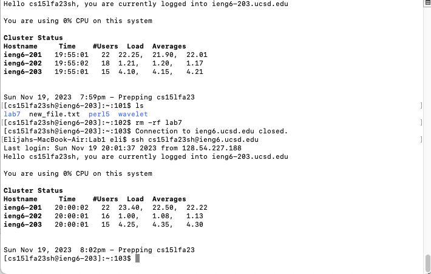
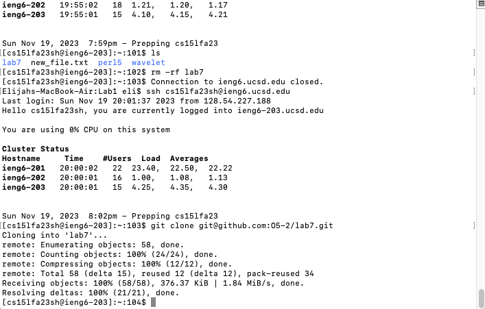
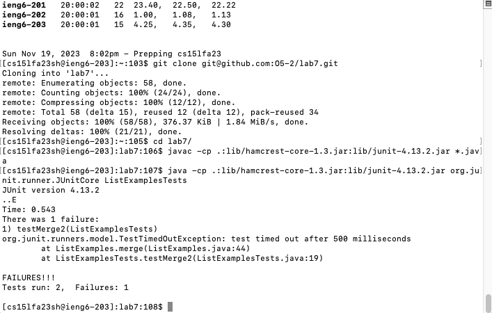
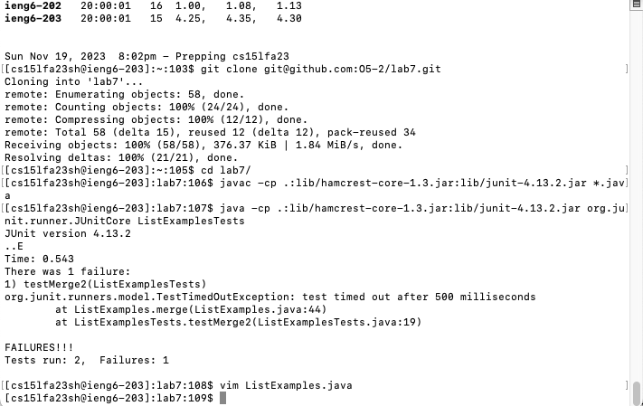
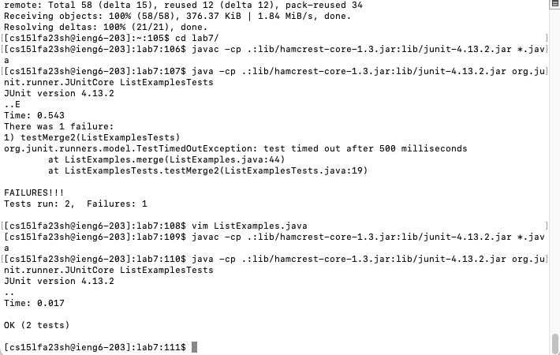
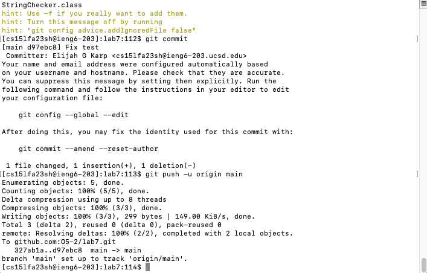

# Lab Report 4
## Vim (Week 7)

*Step 4:*

`<up><enter>`

The `ssh cs15lfa23sh@ieng6.ucsd.edu` command was the last command I had ran on my machine in that Terminal tab, so I used the up arrow once to access it.

*Step 5:*

`<Ctrl-R>gi<enter>`

I accessed the `git clone git@github.com:O5-2/lab7.git` command with Ctrl-R.

*Step 6:*

`cd l<tab><enter>`

I typed `cd l`, then used tab completion to fill in the `lab7` directory.

`<Ctrl-R>javac<enter>`

I accessed the `javac -cp .:lib/hamcrest-core-1.3.jar:lib/junit-4.13.2.jar *.java` command with Ctrl-R.

`<Ctrl-R>java <enter>`

I accessed the `java -cp .:lib/hamcrest-core-1.3.jar:lib/junit-4.13.2.jar org.junit.runner.JUnitCore ListExamplesTests` command with Ctrl-R.

*Step 7:*

`vim L<tab>.<tab><enter>`

I typed `vim L`, then used tab completion to get to `vim ListExamples`, then typed `.`, then used tab completion to get to `vim ListExamples.java`.

`43$2whi<delete>2<esc>:wq<enter>`

These vim commands turn `index1` into `index2`.

*Step 8:*

`<up><up><up><enter>`

The `javac -cp .:lib/hamcrest-core-1.3.jar:lib/junit-4.13.2.jar *.java` command was the fourth-from-last command I had ran on ieng6 in that Terminal tab, so I used the up arrow four times to access it.

`<up><up><up><enter>`

The `java -cp .:lib/hamcrest-core-1.3.jar:lib/junit-4.13.2.jar org.junit.runner.JUnitCore ListExamplesTests` command was the fourth-from-last command I had ran on ieng6 in that Terminal tab, so I used the up arrow four times to access it.

*Step 9:*

`git add ./*<enter>`

This includes all files in the commit.

`git commit<enter>`

This begins the commit.

`iFix test<esc>:wq<enter>`

This adds a commit message and confirms the commit.

`git push -u origin main<enter>`

This pushes the commit to the main branch.
